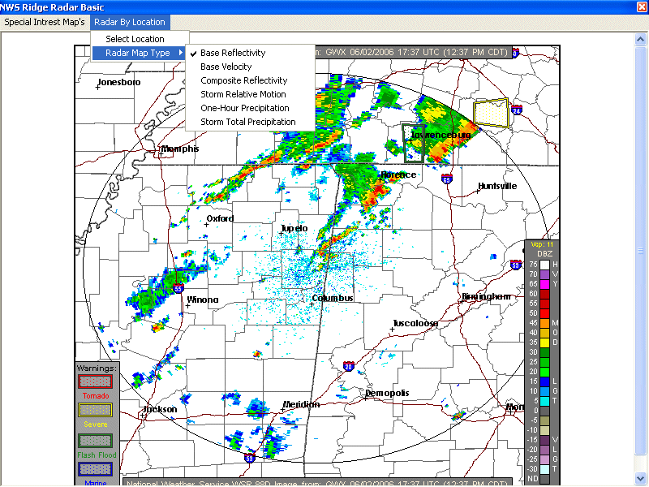



## NWS Ridge Radar Basic

### Description

A nice full screen VB version of the NWS Ridge radar basic. Includes radars from all 50 states as well as special interest maps. You can select between all 6 ridge map styles. Special interest maps include U.S. continent radar and basic surface analysis. The special interest maps can easily be expanded by code. Maps check automatically for updates every 3 minutes. Enjoy !!!
 
### More Info
 

             |
---                |---
**Submitted On**   |2006-06-02 10:26:30
**By**             |[Thomas Swift](https://github.com/Planet-Source-Code/PSCIndex/blob/master/ByAuthor/thomas-swift.md)
**Level**          |Intermediate
**User Rating**    |5.0 (10 globes from 2 users)
**Compatibility**  |VB 6\.0
**Category**       |[Internet/ HTML](https://github.com/Planet-Source-Code/PSCIndex/blob/master/ByCategory/internet-html__1-34.md)
**World**          |[Visual Basic](https://github.com/Planet-Source-Code/PSCIndex/blob/master/ByWorld/visual-basic.md)
**Archive File**   |[NWS\_Ridge\_199825622006\.zip](https://github.com/Planet-Source-Code/thomas-swift-nws-ridge-radar-basic__1-65543/archive/master.zip)

